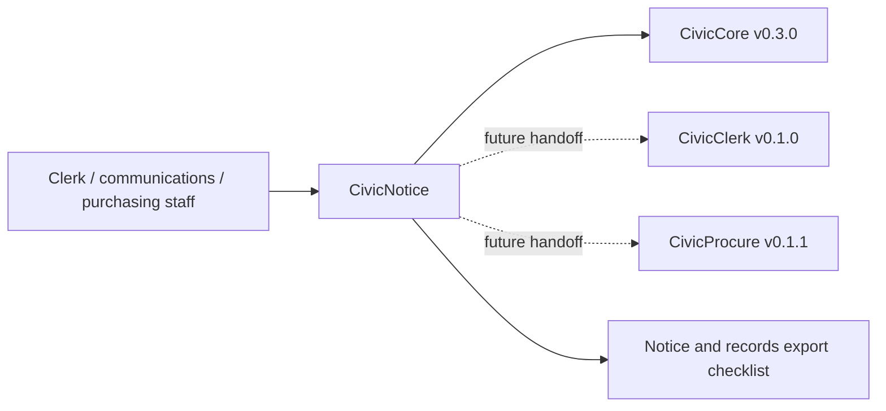

# CivicNotice User Manual

## For Non-Technical Users

CivicNotice helps city staff organize public hearing notices, legal notices, bid notices, vacancy notices, publication deadlines, channel planning notes, proof requirements, and export manifests. It can create a sample notice registry stub, build publication deadline reminders, assemble publication-readiness checklists, summarize channel planning, and assemble a notice/records export checklist.

Current state: `0.1.1` notice compliance foundation release, aligned to `civiccore==0.3.0`. CivicNotice does not decide legal sufficiency, publish official notices, provide legal advice, call live LLMs, write back to publication systems, or update a notice system of record. Staff own every decision.

## For IT and Technical Staff

CivicNotice is a FastAPI Python package pinned to `civiccore==0.3.0`. The current runtime exposes:

- `GET /`
- `GET /health`
- `GET /civicnotice`
- `POST /api/v1/civicnotice/registry`
- `POST /api/v1/civicnotice/deadlines`
- `POST /api/v1/civicnotice/publication-check`
- `POST /api/v1/civicnotice/channels`
- `POST /api/v1/civicnotice/export`

Run:

```bash
python -m pip install -e ".[dev]"
python -m pytest -q
bash scripts/verify-release.sh
```

## Architecture



CivicNotice depends on CivicCore. CivicCore does not depend on CivicNotice. CivicNotice v0.1.1 uses deterministic sample notice data only; live agenda/procurement handoffs, legal sufficiency decisions, legal advice, official notice publication, publication-system write-back, and production notice-system integrations are future work.
