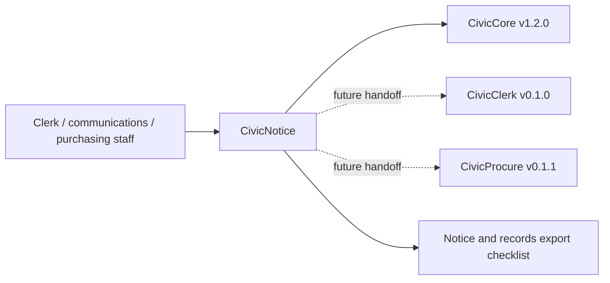

# CivicNotice User Manual

## For Non-Technical Users

CivicNotice helps city staff organize public hearing notices, legal notices, bid notices, vacancy notices, publication deadlines, channel planning notes, proof requirements, staff review queues, and export manifests. It can create a notice registry record, build publication deadline reminders, retrieve saved registry/deadline workpapers from local persistence, assemble publication-readiness checklists, summarize channel planning, and assemble a notice/records export checklist.

Current state: `0.1.2` local-first notice compliance foundation release, aligned to the `civiccore v1.2.0` release wheel. CivicNotice uses the shared CivicCore notice-deadline helper for deterministic reminder plans, but it still does not decide legal sufficiency, publish official notices, provide legal advice, call live LLMs, write back to publication systems, or update a notice system of record. Staff own every decision.

## For IT and Technical Staff

CivicNotice is a FastAPI Python package pinned to the `civiccore v1.2.0` release wheel. The current runtime exposes:

CivicNotice stores workpapers locally by default under `CIVICNOTICE_DATA_DIR`. Set `CIVICNOTICE_WORKPAPER_DB_URL` only when an explicit SQLAlchemy database URL is required. Staff review queue APIs require `CIVICNOTICE_STAFF_API_KEY`.

- `GET /`
- `GET /health`
- `GET /ready`
- `GET /civicnotice`
- `GET /civicnotice/staff`
- `GET /api/v1/civicnotice/readiness`
- `GET /api/v1/civicnotice/integration-contracts`
- `POST /api/v1/civicnotice/registry`
- `GET /api/v1/civicnotice/registry/{record_id}`
- `POST /api/v1/civicnotice/deadlines`
- `GET /api/v1/civicnotice/deadlines/{plan_id}`
- `POST /api/v1/civicnotice/publication-check`
- `POST /api/v1/civicnotice/channels`
- `POST /api/v1/civicnotice/export`
- `GET /api/v1/civicnotice/staff/reviews`
- `POST /api/v1/civicnotice/staff/reviews`

Run:

```bash
python -m pip install -e ".[dev]"
python -m pytest -q
bash scripts/verify-release.sh
```

## Architecture


```mermaid
flowchart LR
  Staff["Clerk / communications / purchasing staff"] --> CivicNotice["CivicNotice"]
  CivicNotice --> CivicCore["CivicCore v1.2.0"]
  CivicNotice -. future handoff .-> CivicClerk["CivicClerk v0.1.0"]
  CivicNotice -. future handoff .-> CivicProcure["CivicProcure v0.1.1"]
  CivicNotice --> Export["Notice and records export checklist"]
```

CivicNotice depends on CivicCore. CivicCore does not depend on CivicNotice. CivicNotice v0.1.2 uses the shared CivicCore notice deadline helper, CivicCore staff-key auth, and deterministic local-first notice data only; live agenda/procurement handoffs, legal sufficiency decisions, legal advice, official notice publication, publication-system write-back, and production notice-system integrations are future work.
